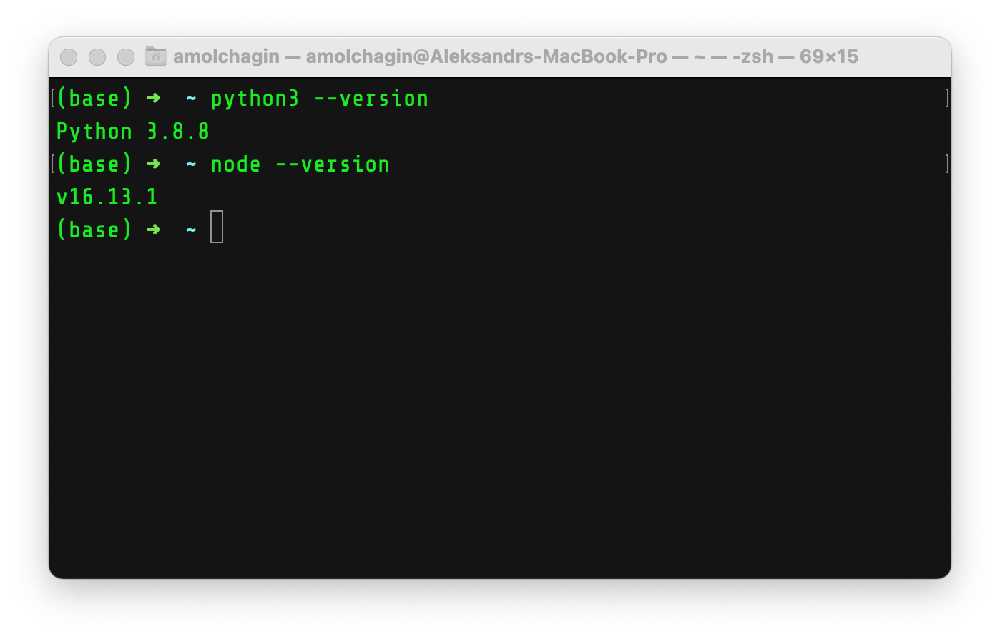

# How to install Python and JES
This file provides instructions on how to install Python and JES for the following platforms:
- macOS (x86, Intel based)
- macOS (arm, M1 based)
- Windows 

:exclamation: If you use x86 Linux, follow macOS (x86) instructions.\
:exclamation: If you use arm Linux, follow macOS (arm) instructions. 

To check if your mac is either Intel based or M1 based, click the Apple Logo at the top left corner and select "About this Mac".

M1 mac will have information similar to what is in the screenshot below:

</img>

Intel based mac will have information similar to what is in the screenshot below:

</img>

## macOS (x86)

1) Install Python: https://www.python.org

2) Install Node.js: https://nodejs.org/en/

3) Check if Python and Node.js are installed:
    - Open terminal App
    - type "python3 --v"
    - type "node --v"

You should have something simillar:

</img>

4) Install VScode: https://code.visualstudio.com

## macOS (arm)

## Instructions for IS:

1) Install Python 3.9.10 (https://www.python.org/downloads/release/python-3910/)
    - Download the Windows 64-bit installer: https://www.python.org/ftp/python/3.9.10/python-3.9.10-amd64.exe
    - Select Add path...
    - Restart the computer (!important)
2) Install VScode: https://code.visualstudio.com/
3) Instal jes4py:
    - Open VScode
    - Open a new terminal within VScode
    - type "python -m pip install -U jes4py" and click "enter"
    - wait until it's done

