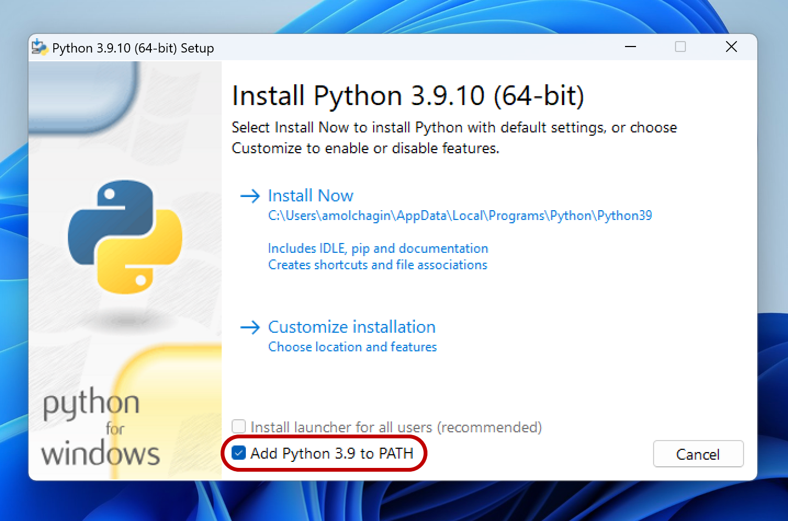
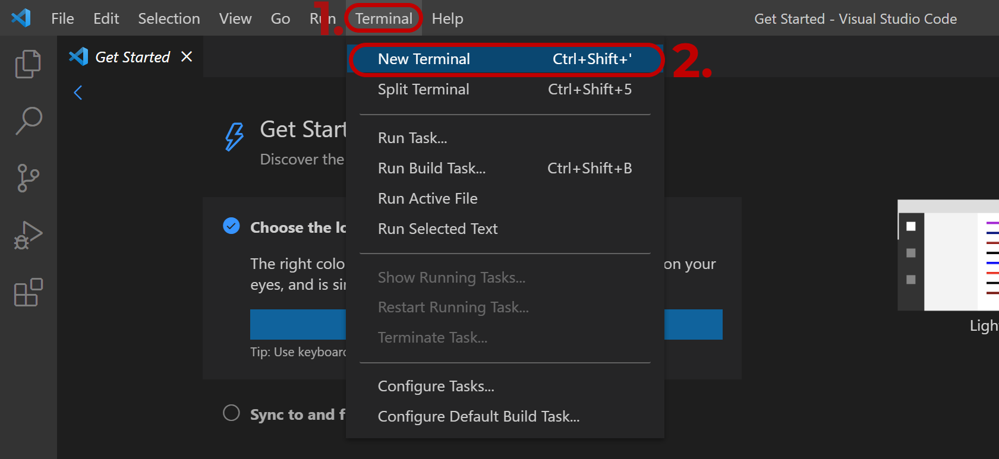
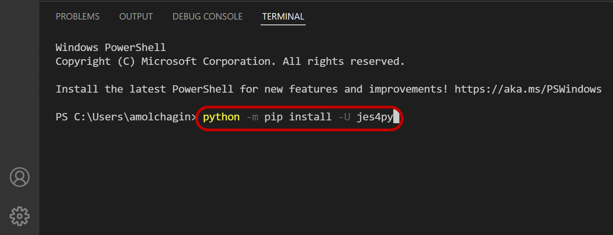
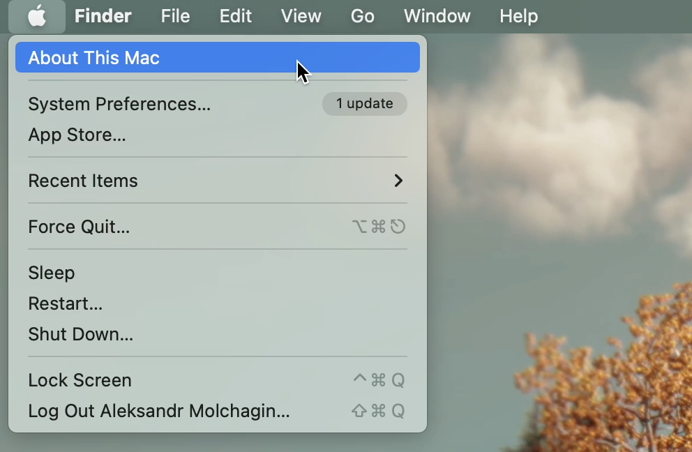
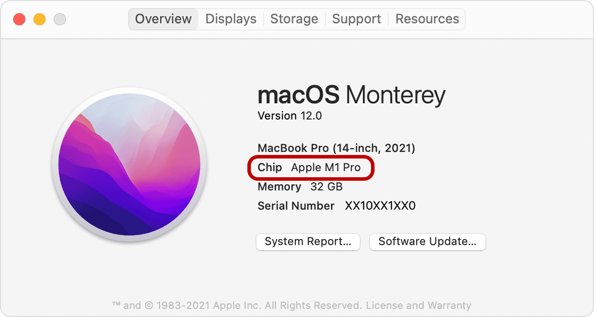
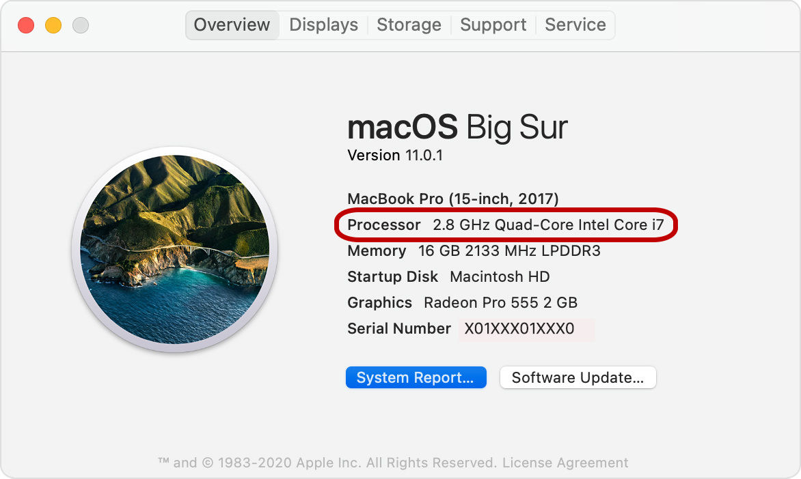
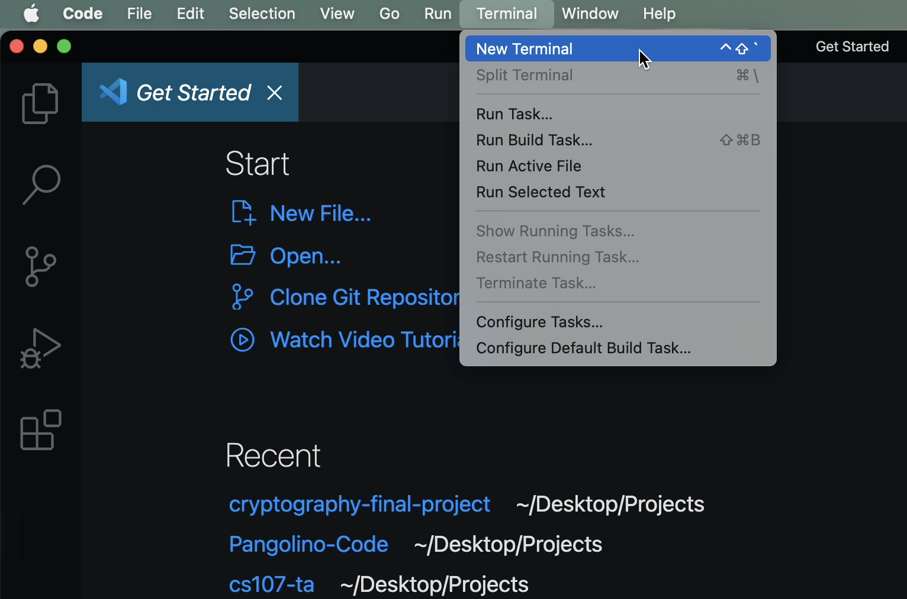

# How to install Python and JES
This file provides instructions on how to install Python and JES for the following platforms:
- Windows 
- macOS (x86, Intel based)
- macOS (ARM, Apple Silicon based)

:exclamation: If you use x86 Linux, follow macOS (x86) instructions.\
:exclamation: If you use ARM Linux, follow macOS (ARM) instructions. 

## Windows

1) Install VS Code: https://code.visualstudio.com/
    - Download the installer 
    - Open the installer and follow its instructions leaving default settings
2) Install Python 3.9.10: https://www.python.org/downloads/release/python-3910/
    - Download the Windows 64-bit installer: https://www.python.org/ftp/python/3.9.10/python-3.9.10-amd64.exe
    - Start the installer and select "Add Python 3.9 to PATH"...
    </img>
    - If possible, select "Install Launcher for all users"
    - Click "Install Now" and wait until it is done
    - Follow any recommendations suggested by the installator (ex. "Disable path length limit")
    - (:exclamation:important) Restart the computer
3) Install jes4py: https://github.com/gordon-cs/JES4py
    - Open VS Code
    - Open a new terminal within VS Code
    </img>
    - Type "python -m pip install -U jes4py" and click "enter"
    </img>
    - Wait until it is done

## macOS

First, we need to check if your mac is either Intel or Apple Silicon based.
To do that click the Apple Logo at the top left corner and select "About this Mac".

</img>

Apple Silicon mac will have information similar to what is in the screenshot below:

</img>

Intel based mac will have information similar to what is in the screenshot below:

</img>

### macOS (x86, Intel based)

1) Install VS Code: https://code.visualstudio.com/
    - Download the installer 
    - Open the installer and follow its instructions leaving default settings
2) Install Python 3.9.10: https://www.python.org/downloads/release/python-3910/
    - Download the installer: https://www.python.org/ftp/python/3.9.10/python-3.9.10-macos11.pkg
    - Run it and follow the installator's instructions
3) Install jes4py: https://github.com/gordon-cs/JES4py
    - Open VS Code
    - Open a new terminal within VS Code
    </img>
    - Type "python3 -m pip install -U jes4py" and click "return"
    </img>
    - Wait until it is done

### macOS (ARM, Apple Silicon Based)

1) Install VS Code: https://code.visualstudio.com/
    - Download the installer 
    - Open the installer and follow its instructions leaving default settings
2) Install Python 3.9.10: https://www.python.org/downloads/release/python-3910/
    - Download the installer: https://www.python.org/ftp/python/3.9.10/python-3.9.10-macos11.pkg
    - Run it and follow the installator's instructions